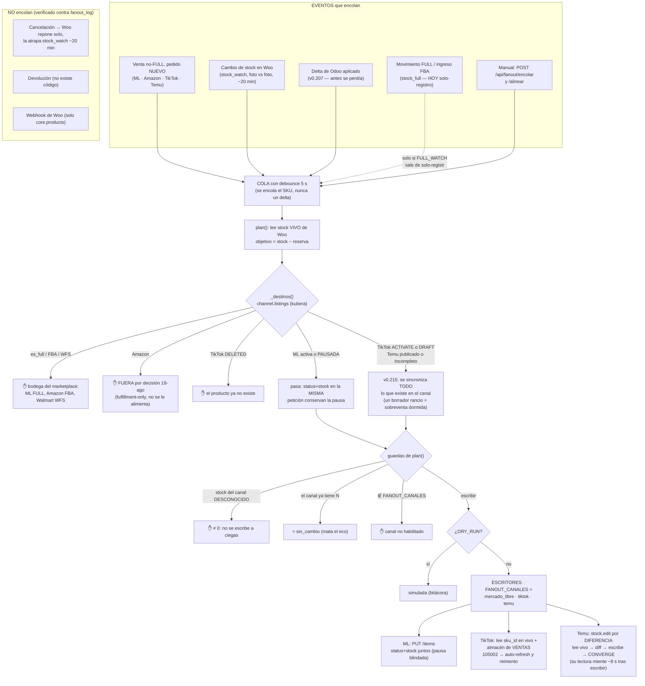

# Auditoría del fan-out de stock — y su reorientación a DROP

> Auditoría del 18-ago-2026 sobre código + `fanout_log` + `channel.listings` +
> las APIs en vivo, con verificación adversarial de los hallazgos centrales.
> **Actualizado el 19-ago** con el estado final: los tres canales DROP vivos y
> sincronizados (v0.207 → v0.215). Cada afirmación lleva su evidencia.

## El titular

**El día de la auditoría, el fan-out solo le escribía a Mercado Libre.** De sus
tres escritores, dos estaban muertos y nadie lo sabía:

| Canal | Estado 18-ago | Desde | Causa |
|---|---|---|---|
| Mercado Libre | ✅ vivo (1,400 escrituras/30d) | — | — |
| Amazon | 💀 congelado | 29-jul 17:13 | bug de vocabulario (abajo) |
| TikTok | 💀 muerto | ~15-ago 00:06 | token vencido, sin auto-refresh |
| Temu | ∅ nunca existió | — | sin escritor, sin visibilidad |

Y la decisión de arquitectura que salió de revisarlo (Brandon, 18-ago):

- **ML, Amazon y Walmart se manejan con su fulfillment** (FULL/FBA/WFS).
  **Amazon queda FUERA del fan-out**: no se le alimenta stock. Las DROP
  pausadas de ML **sí** siguen recibiendo stock (higiene para el día que
  alguna reactive).
- **TikTok y Temu (después SHEIN) son ÚNICAMENTE DROP** — el destino real del
  fan-out.

**Cómo quedó (19-ago):** los tres canales DROP escriben
(`FANOUT_CANALES=mercado_libre,tiktok,temu`), Amazon está fuera por decisión, y
desde v0.215 **se sincroniza todo lo que existe en el canal** — no solo lo que
está a la venta. Un borrador con stock de hace dos semanas es una sobreventa
esperando el día que alguien lo publique, y en TikTok se publican ~300 al día
desde un script de escritorio.

## El diagrama completo (lo que nunca se había dibujado)

Los caminos que mueren son la mayoría y es a propósito: en 30 días, 838
`omitir` y 128 `sin_cambio` contra 1,786 `escribir` (total histórico).

## Tabla de eventos (verificada contra `fanout_log`, no contra el código)

| Evento | ¿Dispara el fan-out? | Evidencia (18-ago) |
|---|---|---|
| Venta en cualquier canal | **SÍ** — solo pedido NUEVO no-FULL | motivos `venta {CUENTA}`: SANCOR 194 · BEKURA 177 · AMAZON 23 · TIKTOK 23 · TEMU 2 pedidos |
| Cancelación de un pedido | **NO directo** — indirecto vía stock_watch (~20 min) | 0 motivos de cancelación en 12,690 filas; Woo repone por `_reduced_stock` y la reposición aparece como `woo_cambio` |
| Devolución | **NO** — no existe manejo | grep de refund/devolución/claim: solo `SALE_CANCELATION → sin efecto` del catálogo FULL |
| Movimiento FULL / ingreso FBA | **Solo registra** (solo-registro) | `full_aviso` 1,766 · `fba_ingreso_sim` 108 · 1 solo `full_ingreso` real (27-jul) |
| Cambio manual de stock en Woo | **SÍ** vía stock_watch | 498 `cambio de stock en Woo` → 101 escrituras |
| Delta de Odoo | **Woo sí · canales NO** (hasta v0.207) | 755 `odoo_delta`; solo 48 llegaron a canales, todos por venta concurrente |

## Los cinco hallazgos que había que ver mirándolo entero

### 1. Amazon murió por un desfase de VOCABULARIO (29-jul 17:13)

El commit `a36b2c6` (v0.33.0, 29-jul 18:06) corrigió el caché: `situacion`
pasó de guardar nuestro `PUBLISHED` a guardar el estado REAL de Amazon
(`BUYABLE`/`DISCOVERABLE`). Pero `_SITUACIONES_VIVAS = {active, published,
publish}` nunca aprendió las palabras nuevas, y esa guarda corre ANTES de la
lectura en vivo que sí sabía distinguirlas. Resultado, con inversión perversa:
**las únicas filas que hoy pasan la guarda son las MUERTAS** (PUBLISHED rancio
que el COALESCE conserva) y las vivas se bloquean antes, con un motivo falso
("escribirle la REACTIVARÍA" — un BUYABLE ya está despierto).

- Última escritura orgánica: 29-jul 17:13 (`venta AMAZON 701-6897747…`).
- 21 omits `situacion=buyable` en 30 días (7 SKUs, 6 con ventas).
- **Con Amazon fuera del fan-out por decisión, el bug NO se corrige: se
  documenta.** Si algún día Amazon regresara, la corrección es una palabra
  (+`buyable` en el set) porque la rama en vivo sigue siendo el juez.

**El stock fantasma se apagó solo.** La auditoría midió 5 BUYABLE MFN con 878
pzas contra Woo 0 (caché de kubera). El one-shot
`scripts/apagar_amazon_fantasma.py` verificó EN VIVO antes de escribir y
encontró: 4 de 5 ya **no existen** en Amazon (HTTP 404) y `CONS-0016-EST` ya
está DISCOVERABLE con cantidad ilegible. **Cero escrituras necesarias**; las 5
verificaciones quedaron selladas en `fanout_log` (`accion='apagar_mfn'`). Las
419 DISCOVERABLE con cantidad declarada no se tocan (decisión) — su riesgo
solo despierta si alguien las reactiva, y eso hoy es un acto manual.

### 2. El tramo «delta de Odoo → canales» no existía (cerrado en v0.207)

`stock_watch` aplicaba el delta a Woo pero solo encolaba `movidos_woo`, y la
foto absorbía el destino: la siguiente pasada veía Woo == foto y los canales
jamás se enteraban. 755 deltas, 48 llegaron — todos de carambola (venta
concurrente). El peor caso es **revivir de 0**: un canal en 0 no vende, sin
venta no hay disparo. Ejemplo del mismo 18-ago: `PAS-0018-AZL` 130→0 y
`TEC-0549-MUL` 50→0 en Woo, invisibles para TikTok.

**Y el bug hermano, peor**: si la escritura a Woo fallaba, la foto absorbía el
destino de todos modos → el delta se perdía PARA SIEMPRE y en silencio
(medidos: ORG-0785, 60 pzas; TEC-0965, +14 de resurtido). Woo divergía de la
bodega física sin dejar rastro.

**v0.207**: `_escribir_woo` reporta QUÉ SKUs quedaron escritos OK; se encola
el fan-out por cada delta aplicado (`motivo="delta de Odoo aplicado"`); la
foto solo absorbe lo escrito OK — lo fallido conserva la memoria y se
reintenta en la siguiente pasada, con la falla anotada en la bitácora.

### 3. TikTok murió por token y nadie tenía el trabajo de revivirlo

`tiktok.refrescar()` existía desde el 8-ago **sin un solo llamador**. El
access_token (~7 días) venció el 15-ago 00:06; el fan-out acumuló 4 errores
`105002 Expired credentials` y las alertas no vigilaban TikTok: 3 días muerto
en silencio. El refresh_token vive hasta 2125 — la reparación siempre estuvo a
una llamada.

**v0.207**, tres capas (la misma medicina que la regla 8 de ML):

1. **Reactiva, siempre encendida**: `tiktok.llamar` detecta `105002`,
   refresca, persiste (UPDATE por `shop_id` — NUNCA `guardar()`, cuyo respaldo
   insertaría una fila con `shop_cipher=NULL` y rompería el canal al revés) y
   reintenta UNA vez con token re-leído. Cubre a todos los consumidores.
2. **Proactiva**: job `tiktok_token` cada 6 h (renueva si faltan <24 h), tras
   `TIKTOK_REFRESH_ENABLED` (nace apagado). Manual: `POST /api/tiktok/token/refrescar`.
3. **Alerta**: el vigilante de Slack ahora avisa si el token vence en <24 h.

### 4. El hueco grande de TikTok no es el token: son los DRAFT

De 902 filas, 599 son DRAFT (497 con stock>0) — y `tk_activar.py` corre desde
el ESCRITORIO (~300 activaciones/día) sin reflejar nada en `channel.listings`.
Publicaciones que pueden estar YA a la venta figuran como borrador y el
fan-out las omite: **sobreventa en potencia**, no solo falta de sync (11
omisiones `status=DRAFT` registradas 14–18 ago). Además el fan-out compara
"sin_cambio" contra el stock del censo del 13-ago: cada veredicto era una
apuesta.

**v0.207**: `services/tiktok_censo.py` — censo por API desde el backend
(pagina `/product/202309/products/search`, upserta status + auditoría + stock
del almacén de VENTAS). Job `tiktok_censo` tras `TIKTOK_CENSO_ENABLED` (nace
apagado) y manual con `POST /api/tiktok/censo`. Con el censo vivo, las
activaciones del escritorio dejan de ser invisibles.

Para la corrida inicial (el fan-out no tiene barrido propio):
`POST /api/fanout/alinear?canal=tiktok&confirmar=true` encola los ACTIVATE
(hoy 285; solo ~24 divergían de Woo) y cada uno pasa por TODAS las guardas.

### 5. Temu: tiene pedidos y filas, le faltan el escritor y los ojos

Las tres piezas por canal, medidas:

| Pieza | TikTok | Temu |
|---|---|---|
| Pedidos → Woo → encolar | ✅ (API propia + M2E) | ✅ (sondeo M2E; webhook propio existe, `PEDIDOS_TEMU_ENABLED=false`) |
| Filas en channel.listings | ✅ 902 (censo 13-ago + `_reflejar` al publicar) | ⚠️ 352 (censo 14-ago, **congelado**; `publicar_temu` no reflejaba) |
| Escritor en `_ESCRITORES` | ✅ (con auto-refresh desde v0.207) | ❌ `bg.local.goods.stock.edit` **jamás llamado** — parámetros NO VERIFICADOS |

El desbalance ya está vivo: **Temu vende y baja el stock de los demás, pero
nadie le escribe a Temu.**

**v0.207 (todo inerte hasta el sondeo)**: `temu` entra a `channel_read.CANALES`
(sus 352 filas por fin son visibles para `_destinos`, aunque sea para
omitirse con motivo escrito); rama propia en `_destinos` — política DROP-only:
a lo PUBLICADO se le escribe aunque el código crudo no distinga
activo/inactivo; `Incompleto`/`Borrador`/desconocido se omiten (falla
cerrada) —; candado `FANOUT_TEMU` (nace apagado); `_reflejar` en
`publicar_temu` (cada alta nueva ya se ve sola); y la sonda
`scripts/sondear_temu_stock.py` — canario de UNA llamada que confirma la forma
del endpoint (goodsId/skuId/outSkuId), imprime la respuesta cruda y verifica
que escribir stock NO altere el estado (la lección de CAM-0030). El escritor
`_escribir_temu` se construye cuando la sonda conteste.

## Odoo: FULL vs DROP (pregunta 4 del encargo)

- **Odoo alimenta SOLO el DROP, y solo por DELTA**: `odoo.listar_catalogo`
  (`odoo.py:98-117`; `free_qty`, fallback `qty_available`) → `stock_watch`
  compara contra su foto y escribe Woo. El valor ABSOLUTO de Odoo no viaja
  (resucitaría mercancía vendida — por eso `odoo_watch.auto_push` está
  bloqueado en `odoo_watch.py:159-165`).
- **El FULL nunca viene de Odoo**: llega del propio marketplace — webhook
  `fbm_stock_operations` de ML y fotos FBA (`/fba/inventory/v1/summaries`).
  `stock_full` está en solo-registro y ahí se queda: el mismo envío físico a
  FULL tiene DOS señales (el delta de Odoo al registrarlo + el webhook cuando
  ML recibe) y si ambas descontaran sería doble resta. **Para el DROP manda el
  delta de Odoo.**
- **Odoo NO distingue almacén en lo que traemos**: el RPC no pasa
  `location`/`warehouse`/context (verificado en `odoo.py` y en todos sus
  llamadores) — es el global de la compañía. Si TEX2 (TEXCO II) guarda
  mercancía destinada a fulfillment, cuenta en el número que alimenta el DROP;
  mitigado porque solo viajan deltas, pero conviene saberlo al leer la
  campana.
- **La campana de `odoo_watch`**: 556 avisos totales, 93 en 7 días; la columna
  `procesado` existe y nadie los consume de forma sistemática. La decisión
  F8-1b (¿darle casa en kubera o apagarlo?) sigue pendiente y la pregunta
  correcta sigue siendo: *¿quién lee esos avisos y qué hace con ellos?*

## Estado de los interruptores tras v0.207

| Interruptor | Estado | Qué enciende |
|---|---|---|
| `FANOUT_CANALES=mercado_libre,tiktok` | **guardado en Railway, aplica en el próximo deploy** | Amazon fuera del fan-out (decisión 18-ago) |
| Auto-refresh reactivo TikTok (105002) | **siempre encendido** (código) | el canal se auto-sana en la primera escritura |
| `TIKTOK_REFRESH_ENABLED` | nace apagado | refresh proactivo cada 6 h |
| `TIKTOK_CENSO_ENABLED` | nace apagado | censo cada 2 h → status/stock vivos |
| `FANOUT_TEMU` | nace apagado | (además falta el escritor: sondear primero) |
| `PEDIDOS_TEMU_ENABLED` | apagado (las ventas entran por M2E) | webhook propio de Temu |

**El orden de encendido propuesto** (cada dale por separado, regla 3):
1. `POST /api/tiktok/token/refrescar` (revive el canal hoy mismo) →
   `POST /api/fanout/alinear?canal=tiktok&confirmar=true` (corrida inicial).
2. `TIKTOK_REFRESH_ENABLED=true` + `TIKTOK_CENSO_ENABLED=true`.
3. Sonda de Temu (1 SKU, con dale) → construir `_escribir_temu` → alineación
   inicial → `FANOUT_TEMU=true` + sumar `temu` a `FANOUT_CANALES`.
4. SHEIN, cuando llegue, repite el patrón de 3 piezas.

## Deudas que esta auditoría deja escritas (no se tocaron)

- La allowlist de IPs es un punto único de falla para TikTok Y Temu: el
  egress de Railway ya cambió una vez (`162.220.232.251 → 152.55.177.181`)
  y ninguna de las dos consolas avisa. Considerar salida fija.
- `_SITUACIONES_VIVAS` sin `buyable`: intrascendente con Amazon fuera, pero es
  la primera línea a tocar si Amazon regresa.
- El fan-out no reescribe `channel.listings.stock_own` tras escribir en el
  canal: el espejo se refresca por los censos, no por las escrituras.
- Cancelaciones/devoluciones siguen sin disparador directo: la red es
  `stock_watch` (~20 min). Suficiente mientras stock_watch viva; si algún día
  se apaga, ese hueco se reabre.
